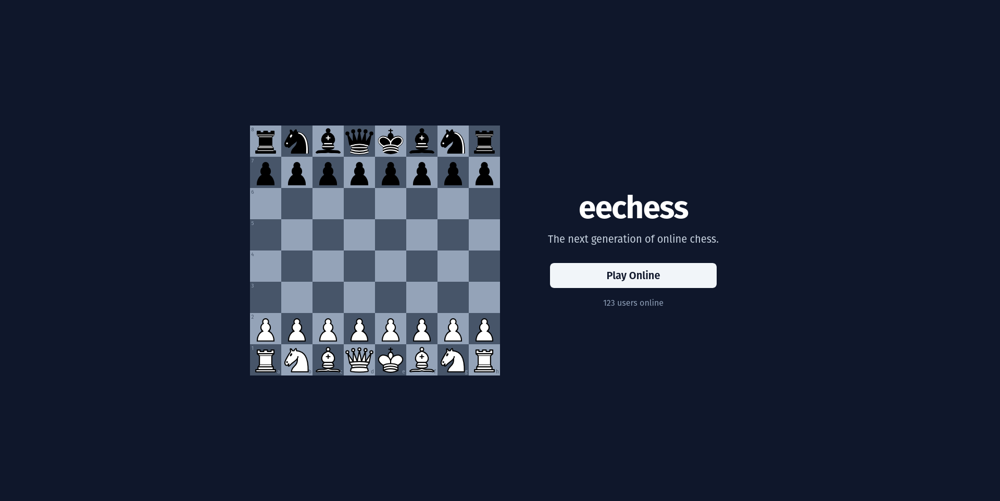
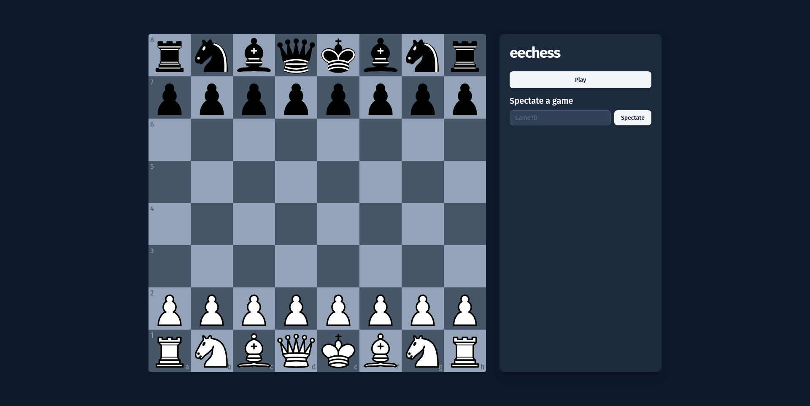

# EeChess

A modern, real-time online chess platform built with React, TypeScript, and WebSockets.

## 🎯 Overview

EeChess is a next-generation online chess application that enables players to compete in real-time matches through a beautiful, responsive web interface. Built with modern web technologies, it provides a seamless gaming experience with instant move synchronization.



## ✨ Features

- **Real-time Gameplay**: Instant move synchronization using WebSocket connections
- **Modern UI**: Beautiful, responsive interface built with React and Tailwind CSS
- **Type Safety**: Full TypeScript implementation for better development experience
- **Chess Engine**: Powered by chess.js for accurate game logic and move validation
- **Cross-platform**: Works on desktop and mobile devices



## 🚀 Tech Stack

### Frontend
- **React 19** - Modern UI framework
- **TypeScript** - Type-safe development
- **Tailwind CSS** - Utility-first CSS framework
- **React Chessboard** - Professional chess board component
- **Vite** - Fast build tool and dev server
- **Radix UI** - Accessible UI components

### Backend
- **Node.js** - JavaScript runtime
- **WebSocket (ws)** - Real-time communication
- **chess.js** - Chess game logic and validation
- **Zod** - Runtime type validation

### Architecture
- **Monorepo** - PNPM workspace for shared code
- **Shared Package** - Common types and constants

## 📦 Project Structure

```
eechess/
├── apps/
│   ├── backend/          # WebSocket server and game logic
│   └── frontend/         # React application
├── packages/
│   └── shared/           # Shared types and constants
└── pnpm-workspace.yaml   # Workspace configuration
```

## 🛠️ Getting Started

### Prerequisites

- Node.js (v18 or higher)
- PNPM (v8 or higher)

### Installation

1. **Clone the repository**
   ```bash
   git clone <repository-url>
   cd eechess
   ```

2. **Install dependencies**
   ```bash
   pnpm install
   ```

3. **Start the development servers**

   In separate terminals:

   ```bash
   # Build the shared package first (required for backend)
   cd packages/shared
   pnpm build
   
   # Build and start the backend server
   cd ../../apps/backend
   pnpm build
   pnpm start
   ```

   ```bash
   # Start the frontend development server
   cd apps/frontend
   pnpm dev
   ```

4. **Open your browser**
   - Frontend: http://localhost:5173
   - Backend WebSocket: ws://localhost:8080

## 🎮 How to Play

1. Navigate to the application in your browser
2. Click "Play Online" to start a new game
3. Wait for an opponent to join
4. Make moves by dragging pieces on the chessboard
5. The game automatically validates moves and enforces chess rules

## 🔧 Development

### Available Scripts

**Backend:**
- `pnpm build` - Build TypeScript to JavaScript
- `pnpm start` - Start the production server

**Frontend:**
- `pnpm dev` - Start development server
- `pnpm build` - Build for production
- `pnpm lint` - Run ESLint
- `pnpm preview` - Preview production build

### WebSocket API

The application uses WebSocket messages for real-time communication:

**Initialize Game:**
```json
{
  "type": "init_game"
}
```

**Make a Move:**
```json
{
  "type": "move",
  "move": {
    "from": "e2",
    "to": "e4"
  }
}
```

**Game Over:**
```json
{
  "type": "game_over"
}
```

## 🚧 Roadmap

- [ ] **Chess Clock** - Add time controls for games
- [ ] **Spectators** - Allow users to watch ongoing games
- [ ] **State Management** - Implement proper game state management
- [ ] **Authentication** - User accounts and persistent sessions
- [ ] **Reconnection** - Handle connection drops gracefully
- [ ] **Game History** - Save and replay completed games
- [ ] **Tournaments** - Organize competitive events

## 🙏 Acknowledgments

- [chess.js](https://github.com/jhlywa/chess.js) - Chess game logic
- [react-chessboard](https://github.com/Clariity/react-chessboard) - Chess board component
- [Tailwind CSS](https://tailwindcss.com/) - CSS framework